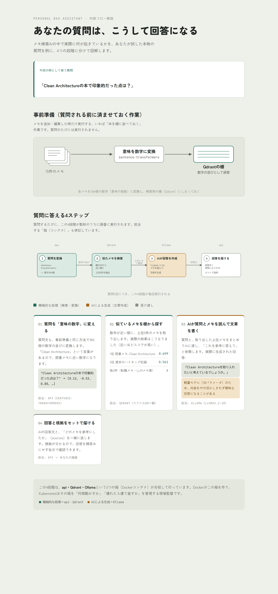

# Personal RAG Assistant

自分のメモ・日記をベクトル検索し、ローカルLLM（Ollama）で質問に答えさせる個人用RAG（Retrieval-Augmented Generation）アシスタント。API課金なしで完全にローカル/コンテナ内で完結する。



*質問から回答が生成されるまでの内部フローを図解したもの（実際に試した質問と結果をもとに作成）。*

## 構成

- **qdrant**: ベクトルDB（公式イメージ）
- **ollama**: ローカルLLM実行環境（回答生成、既定モデル `llama3.2:1b`）
- **ingest**: `data/notes/` のメモをチャンク分割・embedding化してQdrantに登録するバッチジョブ
- **api**: FastAPI。`/query` で質問を受け取り、Qdrant検索→Ollamaで回答生成→出典付きで返却

embeddingは `sentence-transformers`（`all-MiniLM-L6-v2`）でローカル生成するため、こちらもAPI課金なし。

## 前提

- Docker Desktop（WSL2バックエンド推奨）がインストール済みであること
- Python 3.x（ダミーデータ生成スクリプト用。venv不要、標準ライブラリのみ使用）

## セットアップ

```bash
# 1. ダミーの個人メモを生成
python scripts/generate_sample_data.py

# 2. Qdrant と Ollama を起動
docker compose up -d qdrant ollama

# 3. LLMモデルを取得（初回のみ、数百MB〜1GB程度のダウンロード）
docker compose exec ollama ollama pull llama3.2:1b

# 4. メモを取り込み（embedding生成 + Qdrant登録）
docker compose --profile tools run --rm ingest

# 5. APIを起動
docker compose up -d api
```

## 動作確認

```bash
curl http://localhost:8000/health

curl -X POST http://localhost:8000/query \
  -H "Content-Type: application/json" \
  -d '{"question": "Dockerのビルドを速くするコツは？"}'
```

レスポンス例:

```json
{
  "answer": "...",
  "sources": [
    {"source_file": "2026-01-12_docker_notes.md", "text": "...", "score": 0.82}
  ]
}
```

コマンドでのJSON入力が面倒な場合は、ブラウザで `http://localhost:8000/docs` を開くと、FastAPIが自動生成するテスト画面（Swagger UI）から質問を試せる（`POST /query` → 「Try it out」→ `question` に質問を入力 → 「Execute」）。

## モデルの変更

`.env.example` を `.env` にコピーし、`OLLAMA_MODEL` を変更するとPCのスペックに応じてモデルを差し替えられる（例: `llama3.2:3b`, `gemma2:2b`）。変更後は `docker compose exec ollama ollama pull <モデル名>` で取得してから `docker compose up -d api` で再起動する。

既定の`llama3.2:1b`は1B（10億）パラメータと非常に軽量なため、無料・PC内完結を優先できる一方、質問によっては検索結果を活かしきれず曖昧な回答になることがある（動作確認で実際に確認済み）。バグではなくモデルサイズによる限界のため、回答品質を重視する場合は`llama3.2:3b`等への変更を検討する。

## Kubernetesへのデプロイ

`k8s/` にDocker Compose版と同じ構成（qdrant / ollama / api / ingest）のマニフェストを用意している。Docker Desktop同梱のKubernetes機能を有効化（設定 → Kubernetes → Enable Kubernetes）した上で使う（minikube/kind不要）。

アプリのコードは無変更で動く。Docker ComposeもKubernetesも「サービス名でDNS解決できる」という点は共通のため。

```bash
# Compose版とポートが競合するため先に停止
docker compose down

# namespaceとConfigMap
kubectl apply -f k8s/00-namespace.yaml -f k8s/01-configmap-app.yaml -f k8s/02-configmap-notes.yaml

# qdrant / ollama
kubectl apply -f k8s/10-qdrant-pvc.yaml -f k8s/11-qdrant-deployment.yaml -f k8s/12-qdrant-service.yaml
kubectl apply -f k8s/20-ollama-pvc.yaml -f k8s/21-ollama-deployment.yaml -f k8s/22-ollama-service.yaml
kubectl wait --for=condition=Ready pod -l app=qdrant -n personal-rag --timeout=60s
kubectl wait --for=condition=Ready pod -l app=ollama -n personal-rag --timeout=60s

# LLMモデルを取得（Compose版とは別のボリュームのため再取得が必要）
kubectl exec -n personal-rag deploy/ollama -- ollama pull llama3.2:1b

# メモの取り込み（Jobとして1回だけ実行）
kubectl apply -f k8s/40-ingest-job.yaml
kubectl wait --for=condition=Complete job/ingest -n personal-rag --timeout=60s
kubectl logs -n personal-rag job/ingest

# API（2 replicasでステートレスな水平スケールを再現）
kubectl apply -f k8s/30-api-deployment.yaml -f k8s/31-api-service.yaml
kubectl wait --for=condition=Ready pod -l app=api -n personal-rag --timeout=120s
```

### 動作確認・日常の使い方

`k8s/31-api-service.yaml` は `NodePort: 30080` を指定しているが、この環境ではDocker DesktopのNodePort自動フォワーディングがうまく機能しなかったため、代わりに`kubectl port-forward`（`localhost`とクラスタ内のapiをつなぐ橋渡し役）を使う。

**① 状態確認**（PowerShellで、プロジェクトフォルダ内で実行）
```powershell
kubectl get pods -n personal-rag
```
`api`が2つ、`qdrant`・`ollama`が1つずつ`Running`、`ingest`だけ`Completed`になっていればOK（`Completed`は「一回限りの登録作業が正常に終わった」という意味で問題ない）。

**② 橋渡し役を起動**（このウィンドウは開いたままにする。閉じると繋がらなくなる）
```powershell
kubectl port-forward -n personal-rag svc/api 8000:8000
```
`Forwarding from 127.0.0.1:8000 -> 8000` と出れば成功。

**③ 質問を試す（一番簡単な方法）**
②のウィンドウは開いたまま、別のタブでブラウザから以下を開く。
```
http://localhost:8000/docs
```
自動生成されたテスト画面（Swagger UI）が開くので、`POST /query` → 「Try it out」→ `question` 欄に質問を入力 → 「Execute」で回答（`answer`）と参照したメモ（`sources`）が確認できる。コマンドでの文字化けやJSON入力ミスを気にしなくてよいので、一番試しやすい。

コマンドで試したい場合は以下でも可能（Git Bashなど、日本語を含む場合はファイル経由で送るのが安全）:
```bash
curl http://localhost:8000/health
curl -X POST http://localhost:8000/query -H "Content-Type: application/json" -d '{"question": "Kubernetesのconfigmapとsecretの違いは？"}'
```

**PCを再起動した後にまた使いたい場合**: Docker Desktopを起動すれば、Kubernetes上のPod（qdrant/ollama/api）は自動的に元通り動き出す（マニフェストの再適用は不要）。ただし`kubectl port-forward`（②）は再起動のたびに立ち上げ直す必要がある。

**完全に止めたい場合**:
```bash
kubectl delete namespace personal-rag
```
（`personal-rag`名前空間のリソースが全部消える。再度使うにはメモの再登録＝ingestからやり直しが必要）

### 設計メモ

- **Namespace**: `personal-rag` にリソースを分離
- **ConfigMap**: アプリ設定用（`01-configmap-app.yaml`）とノートデータ用（`02-configmap-notes.yaml`、`data/notes/`から生成）を分離。APIキー等の機密情報は現状ないためSecretは未使用だが、Claude APIなど外部キーを追加する場合はSecretで管理する設計にする
- **PVC**: qdrant/ollamaそれぞれに永続ボリュームを割り当て（クラスタのデフォルトStorageClassを使用）。Docker Compose版のvolumeとは別管理
- **Deployment**: qdrant/ollamaはreplicas 1（ステートフル/リソース重量）、apiはreplicas 2（ステートレスなので水平スケール可能）
- **startupProbe**: apiは起動時に`sentence-transformers`の読み込みで時間がかかるため、`startupProbe`で起動の猶予期間を設けている（これがないとliveness probeがタイムアウトしてクラッシュループになる）
- **Job**: ingestは`docker compose run --rm ingest`に相当する一回限りのバッチ実行のため、Deploymentではなく`Job`で実装

## 今後の発展（未実装・ロードマップ）

- 実データ（本物のメモ・ブラウザブックマーク等）への差し替え
- HorizontalPodAutoscaler、Ingressなどのより発展的なKubernetes機能
- Claude API等のクラウドLLMへの切り替えオプション追加（`services/api/app/rag.py` の呼び出し先を差し替えるだけで対応できる設計）
